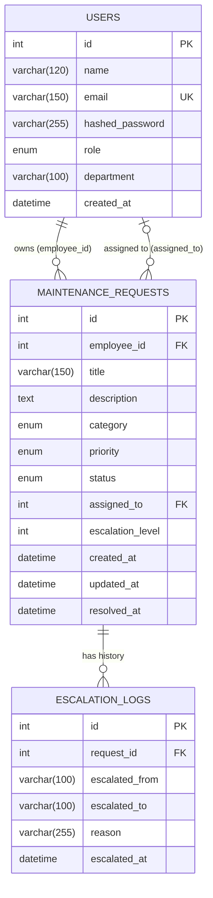

# Database Architecture — Smart Maintenance Request & Escalation System

Owner: Shlok (database architecture)
Engine: MySQL 8.4, InnoDB, `utf8mb4` / `utf8mb4_unicode_ci`
ORM: SQLAlchemy 2.x · Schema managed by Alembic (`alembic/versions/`) — **migrations are the source of truth**, not `Base.metadata.create_all()`.

## Entity relationship diagram



`MAINTENANCE_REQUESTS` has **two independent relationships to `USERS`** through two different foreign keys — `employee_id` (who filed it) and `assigned_to` (who's working it). They're disambiguated in SQLAlchemy with `foreign_keys=` on each `relationship()`, and exposed as `.employee`/`.assignee` on the model and `User.requests`/`User.assigned_requests` on the reverse side.

---

## Table: `users`

| Column | Type | Null | Key | Default | Notes |
|---|---|---|---|---|---|
| `id` | `INT AUTO_INCREMENT` | NO | PK | — | |
| `name` | `VARCHAR(120)` | NO | | — | |
| `email` | `VARCHAR(150)` | NO | UNIQUE | — | login identifier |
| `hashed_password` | `VARCHAR(255)` | NO | | — | bcrypt hash only, never plaintext |
| `role` | `ENUM('employee','admin')` | NO | | `'employee'` | see [Enums](#enum-values) |
| `department` | `VARCHAR(100)` | YES | | `NULL` | |
| `created_at` | `DATETIME` | NO | | `CURRENT_TIMESTAMP` | server-generated, see [Timestamps](#timestamp-strategy) |

**Relationships**
- `requests` → `MaintenanceRequest` where `employee_id = users.id` (one user owns many requests)
- `assigned_requests` → `MaintenanceRequest` where `assigned_to = users.id` (one user is assigned many requests)

---

## Table: `maintenance_requests`

| Column | Type | Null | Key | Default | Notes |
|---|---|---|---|---|---|
| `id` | `INT AUTO_INCREMENT` | NO | PK | — | |
| `employee_id` | `INT` | NO | FK → `users.id` | — | `ON DELETE RESTRICT` |
| `title` | `VARCHAR(150)` | NO | | — | |
| `description` | `TEXT` | NO | | — | |
| `category` | `ENUM('IT','Facilities','Infrastructure','Other')` | NO | | `'Other'` | not indexed — no query filters by category today |
| `priority` | `ENUM('Low','Medium','High')` | NO | | `'Medium'` | |
| `status` | `ENUM('Pending','In Progress','Resolved','Escalated')` | NO | idx | `'Pending'` | |
| `assigned_to` | `INT` | YES | FK → `users.id` | `NULL` | `ON DELETE SET NULL` |
| `escalation_level` | `INT` | NO | | `0` | incremented on each escalation |
| `created_at` | `DATETIME` | NO | idx | `CURRENT_TIMESTAMP` | server-generated |
| `updated_at` | `DATETIME` | NO | | `CURRENT_TIMESTAMP ON UPDATE CURRENT_TIMESTAMP` | MySQL auto-updates this on *any* UPDATE, including raw SQL |
| `resolved_at` | `DATETIME` | YES | | `NULL` | app sets this explicitly only when `status → Resolved` |

**Relationships**
- `employee` → `User` (via `employee_id`) — who filed the request
- `assignee` → `User` (via `assigned_to`) — who it's assigned to
- `logs` → `EscalationLog[]`, `cascade="all, delete-orphan"` — full escalation history

---

## Table: `escalation_logs`

| Column | Type | Null | Key | Default | Notes |
|---|---|---|---|---|---|
| `id` | `INT AUTO_INCREMENT` | NO | PK | — | |
| `request_id` | `INT` | NO | FK → `maintenance_requests.id`, idx | — | `ON DELETE CASCADE` |
| `escalated_from` | `VARCHAR(100)` | YES | | `NULL` | previous status/owner at time of escalation |
| `escalated_to` | `VARCHAR(100)` | YES | | `NULL` | new status/owner/target |
| `reason` | `VARCHAR(255)` | NO | | — | why it escalated |
| `escalated_at` | `DATETIME` | NO | | `CURRENT_TIMESTAMP` | server-generated |

**Relationship**
- `request` → `MaintenanceRequest` (via `request_id`) — one request has many escalation log rows; a log row can't exist without its parent request.

---

## Enum values

Persisted as MySQL native `ENUM` columns storing the **human-readable value**, not a Python identifier (see `app/enums.py::SmartEnum` / `smart_enum_column()`). This matters specifically for `status`, where the Python member name `InProgress` differs from its stored value `"In Progress"`.

| Domain | Values (as stored in MySQL) |
|---|---|
| `role` | `employee`, `admin` |
| `category` | `IT`, `Facilities`, `Infrastructure`, `Other` |
| `priority` | `Low`, `Medium`, `High` |
| `status` | `Pending`, `In Progress`, `Resolved`, `Escalated` |

---

## Foreign keys & delete behavior

| FK | On delete | Why |
|---|---|---|
| `maintenance_requests.employee_id → users.id` | **RESTRICT** | A user with request history can't be deleted outright — deleting them would silently erase maintenance history. Forces a deliberate reassignment/archive step first. (Changed from the original schema's `CASCADE`.) |
| `maintenance_requests.assigned_to → users.id` | **SET NULL** | Removing/deleting an assignee must not delete or block deletion of the request — it just becomes unassigned. |
| `escalation_logs.request_id → maintenance_requests.id` | **CASCADE** | Escalation history has no meaning without its parent request; deleting a request deliberately should take its history with it. Mirrored at the ORM level with `cascade="all, delete-orphan"`. |

---

## Indexes

| Index | Table.column(s) | Query it supports | Why not elsewhere |
|---|---|---|---|
| `ix_users_email` | `users.email` (UNIQUE) | Login lookup by email | — |
| `ix_requests_status` | `maintenance_requests.status` | `GET /requests?status_filter=` (admin dashboard filtering) | |
| `ix_requests_created_at` | `maintenance_requests.created_at` | `ORDER BY created_at DESC` on `/requests` and `/requests/my` | |
| *(implicit)* | `maintenance_requests.employee_id` | `GET /requests/my` (filter by owner) | Not added explicitly — InnoDB auto-creates an index on any FK column to support the constraint, so a redundant explicit index was skipped. |
| *(implicit)* | `maintenance_requests.assigned_to` | Assignment lookups | Same as above — FK-backed already. |
| *(implicit)* | `escalation_logs.request_id` | "history for this request" (the only query pattern this table serves) | Same as above. |

No indexes were added on `title`, `description`, `reason`, `department`, etc. — nothing in the application queries by them, and an index only pays for itself if a real query needs it.

---

## Timestamp strategy

**Single rule: every timestamp is generated by MySQL (`server_default=CURRENT_TIMESTAMP`), never by Python's `datetime.utcnow()`.** This keeps values correct and consistent whether a row is written through the ORM, a migration, a seed script, or raw SQL — and avoids app-server/DB clock drift. The dev MySQL instance's `time_zone` is pinned to `+00:00` so server-generated values line up with the one deliberate exception:

- `resolved_at` has no default — it's only meaningful on one specific transition (`status → Resolved`), so it's set explicitly in application code (`datetime.now(timezone.utc)`, not the deprecated `datetime.utcnow()`).
- `updated_at` uses MySQL's own `ON UPDATE CURRENT_TIMESTAMP` clause, so it updates automatically on **every** UPDATE statement — the application never sets it manually.

---

## Migrations

Schema changes go through Alembic (`backend/alembic/`), which imports `app.database.Base` / `app.models` directly so migrations can never drift from the ORM models.

```bash
alembic upgrade head        # apply all pending migrations
alembic downgrade base      # roll back to empty (tested and working)
alembic revision --autogenerate -m "description"   # generate a new migration after model changes
```

`schema.sql` at the repo root is kept only as a **non-authoritative reference dump** (exact `mysqldump --no-data` output as of migration `38d634b582a0`) for anyone who wants to read the DDL without installing Alembic — if it and the migrations ever disagree, the migrations win.
