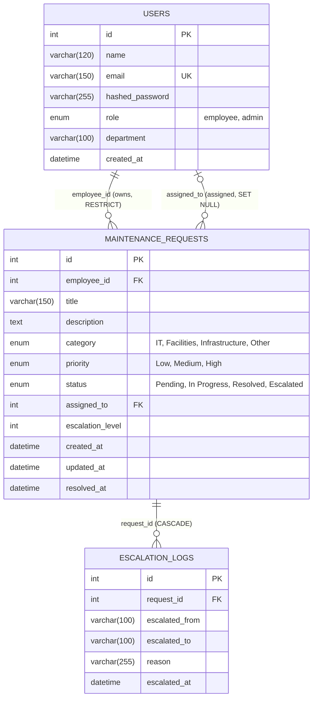

# Database ERD — Smart Maintenance Request & Escalation System

Actual implemented column names, from `app/models.py` / live MySQL schema. See [`database-contract.md`](./database-contract.md) for full column-level detail.

## Reading this diagram

- `USERS ||--o{ MAINTENANCE_REQUESTS` (top edge, `employee_id`): one user can own **zero or more** requests; every request must have **exactly one** owning employee. Deleting a user with requests is **rejected** (`ON DELETE RESTRICT`).
- `USERS |o--o{ MAINTENANCE_REQUESTS` (bottom edge, `assigned_to`): one user can be assigned **zero or more** requests; a request has **zero or one** assignee (nullable). Deleting an assigned user **un-assigns** their requests (`ON DELETE SET NULL`).
- `MAINTENANCE_REQUESTS ||--o{ ESCALATION_LOGS`: one request has **zero or more** escalation log rows; every log row must belong to **exactly one** request. Deleting a request **deletes its logs** (`ON DELETE CASCADE`).

`employee_id` and `assigned_to` are drawn as two separate edges because they are two separate foreign keys to the same table, representing two different business relationships — not a many-to-many.
